## API Task 1 testing Report

- #### Enrolling following voiceID: Anita:14

  1- Enrolling parameters for Anita voicid recording (emotion_happy used in screenshot):

  

Response:			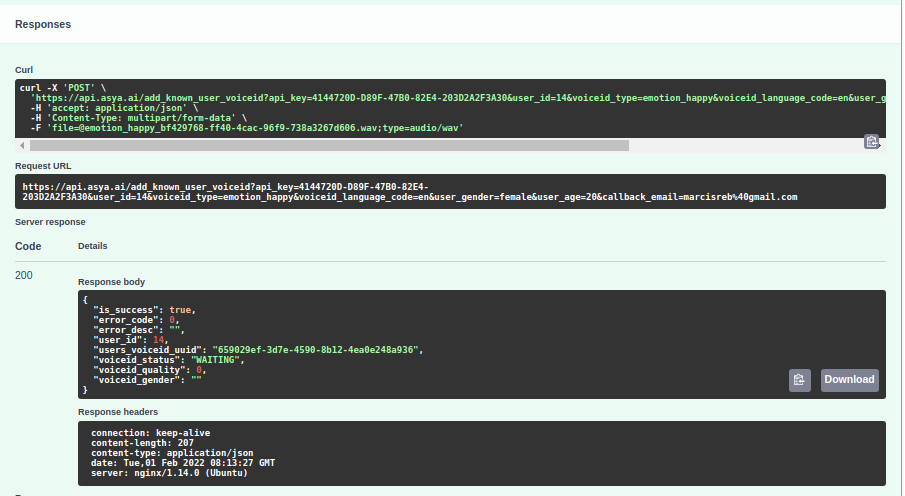

Checking /list_known_user_voiceids after first POST request of emotion_happy:


Executing /add_known_user_voiceid with emotion_calm and then running /list_known_user_voiceids:

Example "still waiting" for emotion_calm:

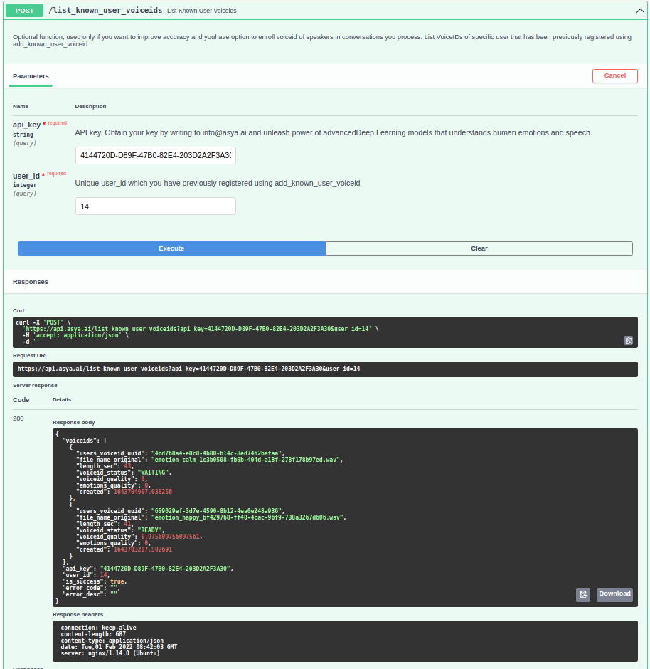

emotion_calm is "READY":

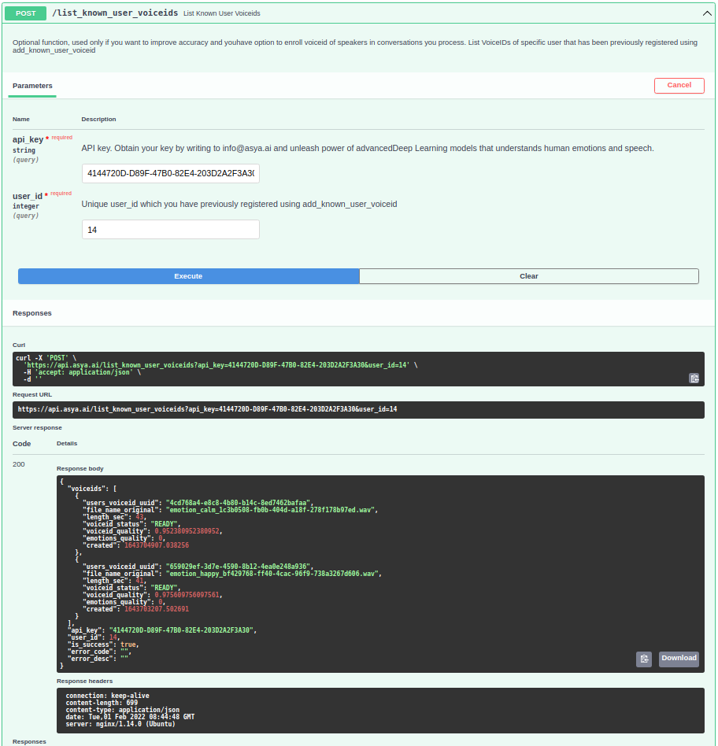

Also running /list_known_users after processing "emotion_happy" and "emotion_calm":

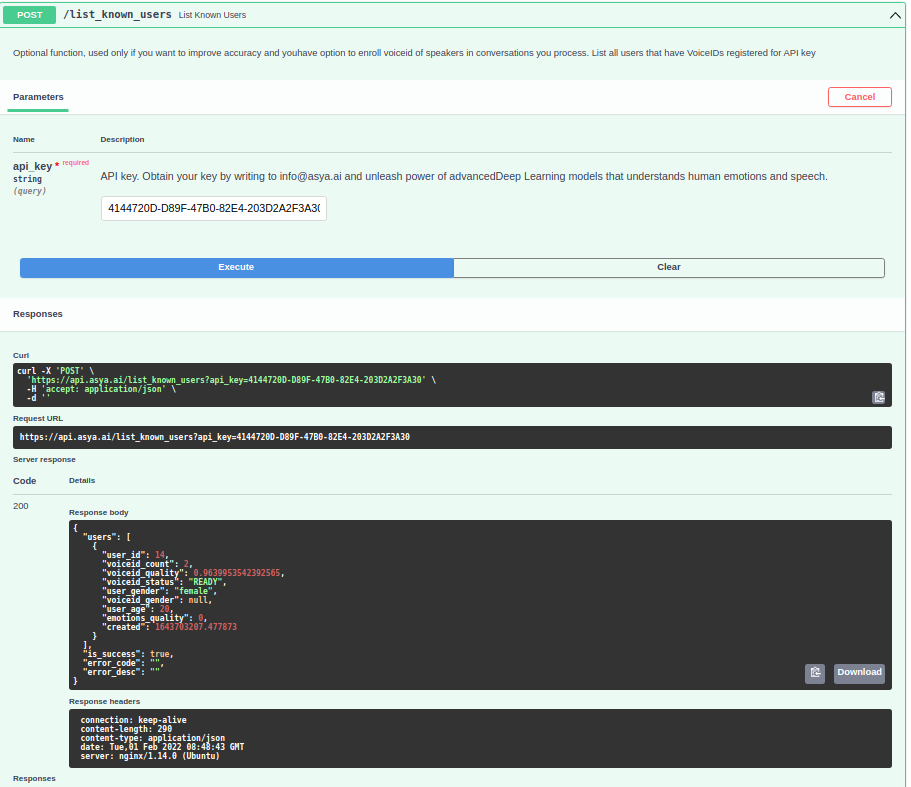

Repeat for all recordings in current user voiceid, changing only "voiceid_type" in /add_known_user_voiceid:

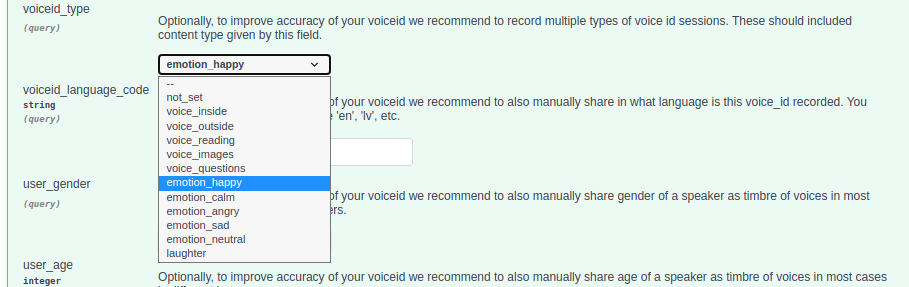

After adding all user known voiceid's, call to /list_known_user_voiceids returns response:

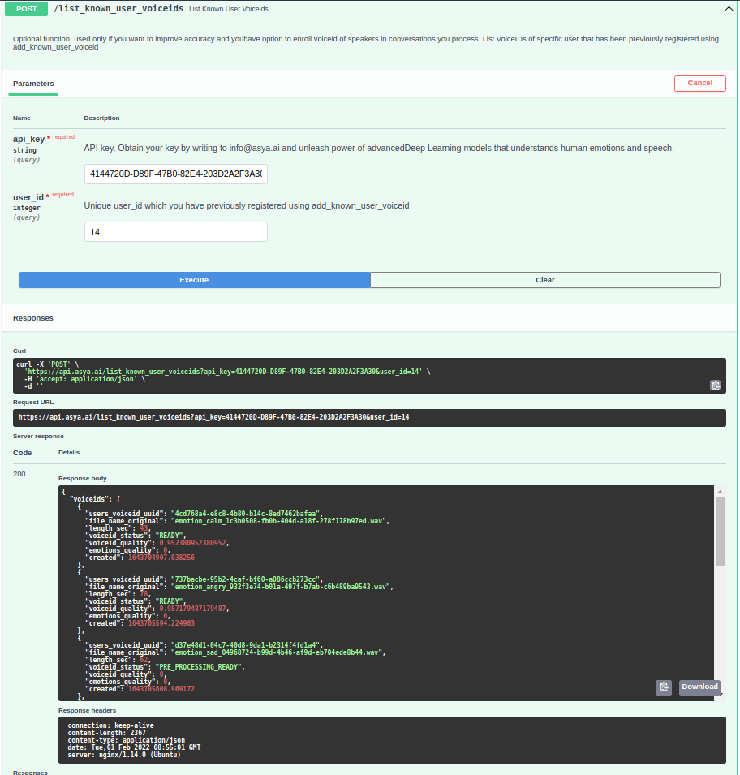

Full Response body:

```json
{
  "voiceids": [
    {
      "users_voiceid_uuid": "4cd768a4-e8c8-4b80-b14c-8ed7462bafaa",
      "file_name_original": "emotion_calm_1c3b0508-fb0b-404d-a18f-278f178b97ed.wav",
      "length_sec": 43,
      "voiceid_status": "READY",
      "voiceid_quality": 0.952380952380952,
      "emotions_quality": 0,
      "created": 1643704907.038256
    },
    {
      "users_voiceid_uuid": "737bacbe-95b2-4caf-bf60-a086ccb273cc",
      "file_name_original": "emotion_angry_932f3e74-b01a-497f-b7ab-c6b489ba9543.wav",
      "length_sec": 78,
      "voiceid_status": "READY",
      "voiceid_quality": 0.987179487179487,
      "emotions_quality": 0,
      "created": 1643705594.224903
    },
    {
      "users_voiceid_uuid": "d37e48d1-04c7-40d8-9da1-b2314f4fd1a4",
      "file_name_original": "emotion_sad_04968724-b99d-4b46-af9d-eb704ede8b44.wav",
      "length_sec": 62,
      "voiceid_status": "PRE_PROCESSING_READY",
      "voiceid_quality": 0,
      "emotions_quality": 0,
      "created": 1643705608.969172
    },
    {
      "users_voiceid_uuid": "39178bee-45e8-4ef7-aa0b-c8f9b768ddf9",
      "file_name_original": "laughter_cb14c70d-1ca2-4da7-a55e-a9dc74b380cd.wav",
      "length_sec": 24,
      "voiceid_status": "PRE_PROCESSING",
      "voiceid_quality": 0,
      "emotions_quality": 0,
      "created": 1643705639.631371
    },
    {
      "users_voiceid_uuid": "b3492815-f047-4a5b-a344-8d9b8588d971",
      "file_name_original": "voice_questions_02097909-617e-4453-bfc2-97a771256f89.wav",
      "length_sec": 67,
      "voiceid_status": "PRE_PROCESSING",
      "voiceid_quality": 0,
      "emotions_quality": 0,
      "created": 1643705652.091362
    },
    {
      "users_voiceid_uuid": "c77245bd-0f0c-4837-a36e-0bec1dc0c478",
      "file_name_original": "voice_reading_44e49a0c-fc77-4547-9a42-c90c17d75056.wav",
      "length_sec": 136,
      "voiceid_status": "PRE_PROCESSING",
      "voiceid_quality": 0,
      "emotions_quality": 0,
      "created": 1643705678.321339
    },
    {
      "users_voiceid_uuid": "0a1ee7a4-dad4-4e3f-aad4-17aecc2765db",
      "file_name_original": "voice_images_c6143f7d-2c30-42c5-b967-a05807d7f56c.wav",
      "length_sec": 78,
      "voiceid_status": "PRE_PROCESSING",
      "voiceid_quality": 0,
      "emotions_quality": 0,
      "created": 1643705667.219785
    },
    {
      "users_voiceid_uuid": "659029ef-3d7e-4590-8b12-4ea0e248a936",
      "file_name_original": "emotion_happy_bf429768-ff40-4cac-96f9-738a3267d606.wav",
      "length_sec": 41,
      "voiceid_status": "READY",
      "voiceid_quality": 0.975609756097561,
      "emotions_quality": 0,
      "created": 1643703207.502691
    }
  ],
  "api_key": "4144720D-D89F-47B0-82E4-203D2A2F3A30",
  "user_id": 14,
  "is_success": true,
  "error_code": "",
  "error_desc": ""
}
```

/list_known_users response:

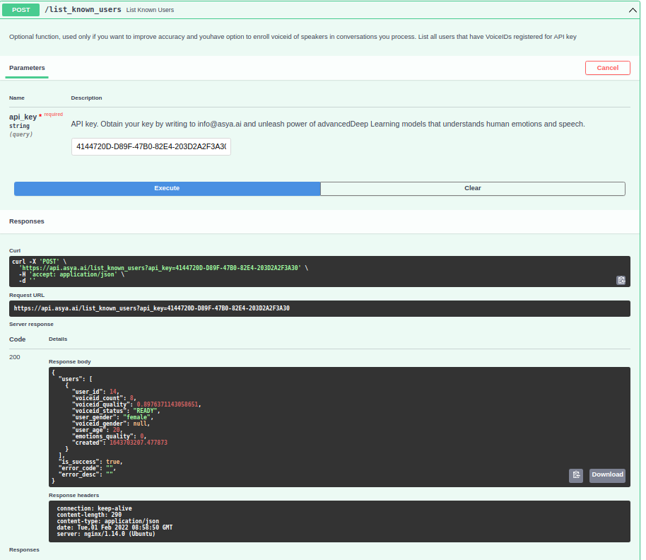


____

Adding another user voiceids/ Ariel, user_id=16:


Response:

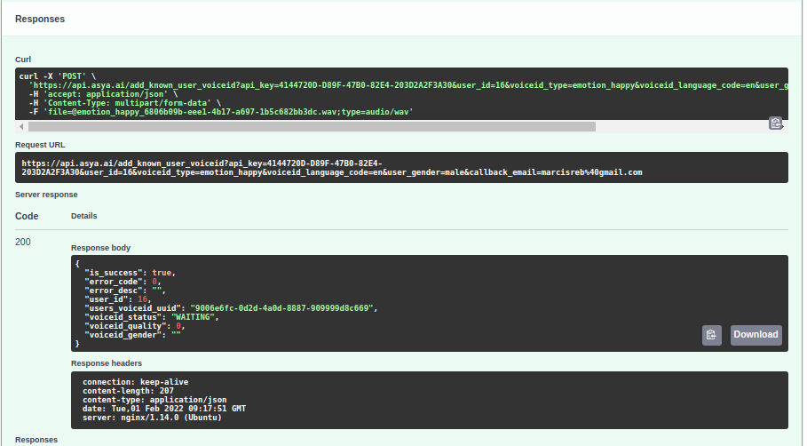

/list_known_user_voiceids for Ariel after adding emotion_happy:

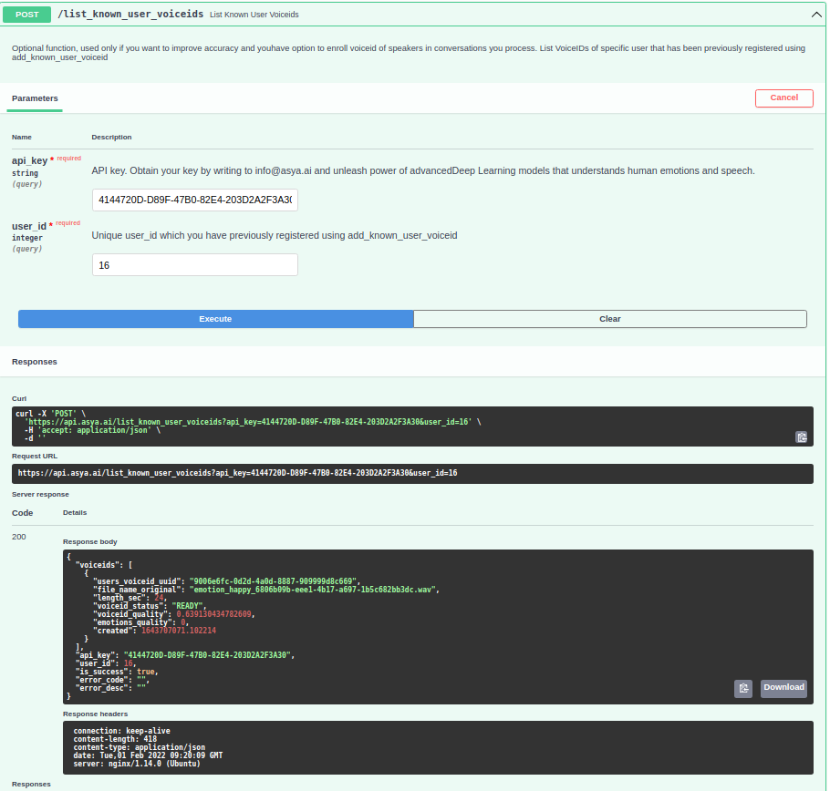

/list_known_users now lists 2 known users with voiceids:

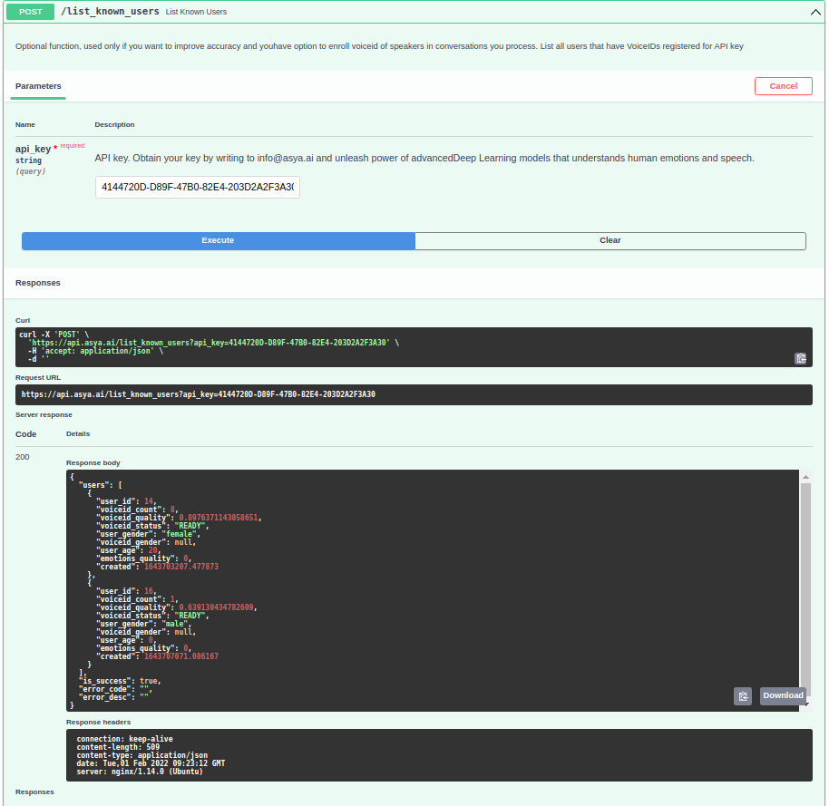

Adding all recordings for Ariel, changing only "voiceid_type" in /add_known_user_voiceid:


Response from /list_known_user_voiceids:


Full Response body:

```json
{
  "voiceids": [
    {
      "users_voiceid_uuid": "57d33cde-20f5-4b77-a75f-0f3160785bb5",
      "file_name_original": "emotion_calm_849824de-bb2b-4c35-aad6-531f369d43d8.wav",
      "length_sec": 28,
      "voiceid_status": "READY",
      "voiceid_quality": 0.771604938271605,
      "emotions_quality": 0,
      "created": 1643707757.63111
    },
    {
      "users_voiceid_uuid": "6390f829-43e1-4999-8726-b209e1c3acf1",
      "file_name_original": "emotion_angry_4588b318-0bf6-40bc-8382-f9cd75e36c51.wav",
      "length_sec": 30,
      "voiceid_status": "READY",
      "voiceid_quality": 0.934444444444444,
      "emotions_quality": 0,
      "created": 1643707767.445891
    },
    {
      "users_voiceid_uuid": "017e9f74-f1f6-4992-907d-d87399e24f5a",
      "file_name_original": "emotion_sad_9b98cc13-42af-466e-84f4-4c21460ccba9.wav",
      "length_sec": 32,
      "voiceid_status": "READY",
      "voiceid_quality": 0.876041666666667,
      "emotions_quality": 0,
      "created": 1643707780.934471
    },
    {
      "users_voiceid_uuid": "28f12a55-7b70-41ab-a318-2f7d0066b299",
      "file_name_original": "laughter_5f497f66-753c-4e2e-a0d2-cf85dc4066c1.wav",
      "length_sec": 12,
      "voiceid_status": "READY",
      "voiceid_quality": 0.225,
      "emotions_quality": 0,
      "created": 1643707791.751408
    },
    {
      "users_voiceid_uuid": "76c34f9b-4746-4cf6-a809-ce8988782964",
      "file_name_original": "voice_images_3d4e313c-af2f-4180-b9cf-c7bf08f8adf0.wav",
      "length_sec": 63,
      "voiceid_status": "READY",
      "voiceid_quality": 0.920634920634921,
      "emotions_quality": 0,
      "created": 1643707811.044719
    },
    {
      "users_voiceid_uuid": "94063957-b994-44d5-af68-b5b09c264d2c",
      "file_name_original": "voice_questions_53c9a6fc-a7b1-4871-a5b0-a189cbd7315f.wav",
      "length_sec": 63,
      "voiceid_status": "READY",
      "voiceid_quality": 0.904761904761905,
      "emotions_quality": 0,
      "created": 1643707802.459939
    },
    {
      "users_voiceid_uuid": "d79204db-f283-4ff5-bd72-6bb7e7dc88d6",
      "file_name_original": "voice_reading_f18015a9-6a06-43d1-9be2-5360e40998c0.wav",
      "length_sec": 65,
      "voiceid_status": "READY",
      "voiceid_quality": 0.96875,
      "emotions_quality": 0,
      "created": 1643707823.130204
    },
    {
      "users_voiceid_uuid": "9006e6fc-0d2d-4a0d-8887-909999d8c669",
      "file_name_original": "emotion_happy_6806b09b-eee1-4b17-a697-1b5c682bb3dc.wav",
      "length_sec": 24,
      "voiceid_status": "READY",
      "voiceid_quality": 0.639130434782609,
      "emotions_quality": 0,
      "created": 1643707071.102214
    }
  ],
  "api_key": "4144720D-D89F-47B0-82E4-203D2A2F3A30",
  "user_id": 16,
  "is_success": true,
  "error_code": "",
  "error_desc": ""
}
```

___

### /delete_known_user_voiceid test

Deleting, for example, voiceid of Ariel "emotion_calm":

```json
{
  "voiceids": [
    {
      "users_voiceid_uuid": "57d33cde-20f5-4b77-a75f-0f3160785bb5",
      "file_name_original": "emotion_calm_849824de-bb2b-4c35-aad6-531f369d43d8.wav",
      "length_sec": 28,
      "voiceid_status": "READY",
      "voiceid_quality": 0.771604938271605,
      "emotions_quality": 0,
      "created": 1643707757.63111
    },
    ...
```

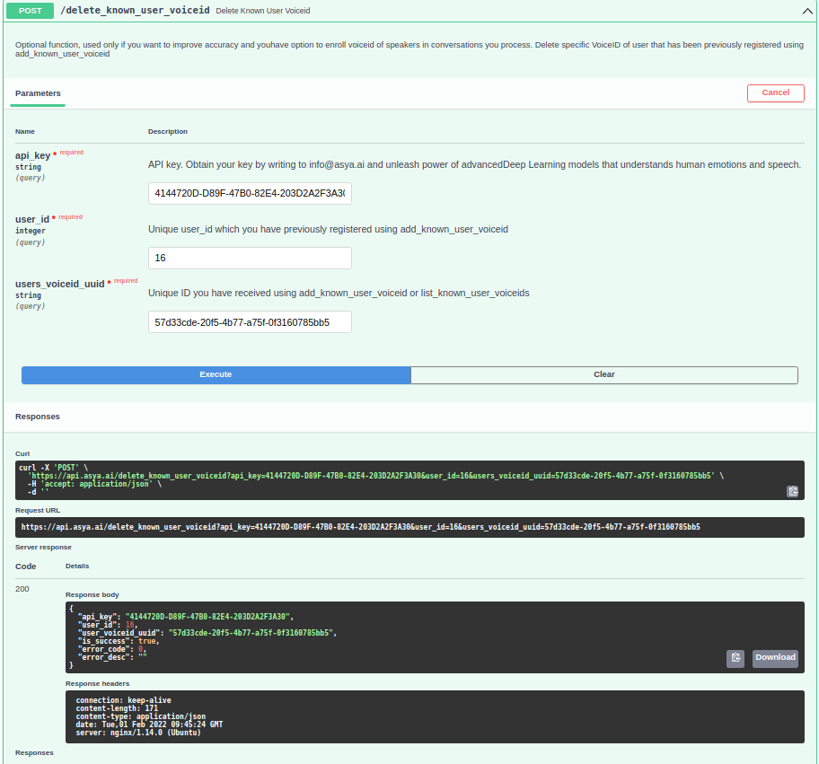

Running /list_known_user_voiceids response:

Voiceid emotion_calm is deleted:

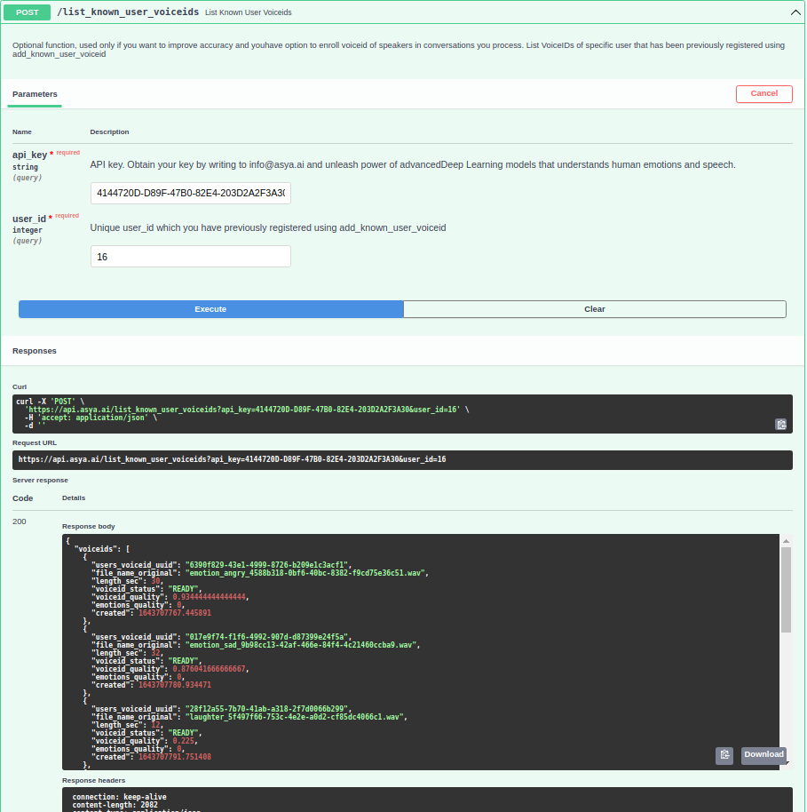

Full response body:

```json
{
  "voiceids": [
    {
      "users_voiceid_uuid": "6390f829-43e1-4999-8726-b209e1c3acf1",
      "file_name_original": "emotion_angry_4588b318-0bf6-40bc-8382-f9cd75e36c51.wav",
      "length_sec": 30,
      "voiceid_status": "READY",
      "voiceid_quality": 0.934444444444444,
      "emotions_quality": 0,
      "created": 1643707767.445891
    },
    {
      "users_voiceid_uuid": "017e9f74-f1f6-4992-907d-d87399e24f5a",
      "file_name_original": "emotion_sad_9b98cc13-42af-466e-84f4-4c21460ccba9.wav",
      "length_sec": 32,
      "voiceid_status": "READY",
      "voiceid_quality": 0.876041666666667,
      "emotions_quality": 0,
      "created": 1643707780.934471
    },
    {
      "users_voiceid_uuid": "28f12a55-7b70-41ab-a318-2f7d0066b299",
      "file_name_original": "laughter_5f497f66-753c-4e2e-a0d2-cf85dc4066c1.wav",
      "length_sec": 12,
      "voiceid_status": "READY",
      "voiceid_quality": 0.225,
      "emotions_quality": 0,
      "created": 1643707791.751408
    },
    {
      "users_voiceid_uuid": "76c34f9b-4746-4cf6-a809-ce8988782964",
      "file_name_original": "voice_images_3d4e313c-af2f-4180-b9cf-c7bf08f8adf0.wav",
      "length_sec": 63,
      "voiceid_status": "READY",
      "voiceid_quality": 0.920634920634921,
      "emotions_quality": 0,
      "created": 1643707811.044719
    },
    {
      "users_voiceid_uuid": "94063957-b994-44d5-af68-b5b09c264d2c",
      "file_name_original": "voice_questions_53c9a6fc-a7b1-4871-a5b0-a189cbd7315f.wav",
      "length_sec": 63,
      "voiceid_status": "READY",
      "voiceid_quality": 0.904761904761905,
      "emotions_quality": 0,
      "created": 1643707802.459939
    },
    {
      "users_voiceid_uuid": "d79204db-f283-4ff5-bd72-6bb7e7dc88d6",
      "file_name_original": "voice_reading_f18015a9-6a06-43d1-9be2-5360e40998c0.wav",
      "length_sec": 65,
      "voiceid_status": "READY",
      "voiceid_quality": 0.96875,
      "emotions_quality": 0,
      "created": 1643707823.130204
    },
    {
      "users_voiceid_uuid": "9006e6fc-0d2d-4a0d-8887-909999d8c669",
      "file_name_original": "emotion_happy_6806b09b-eee1-4b17-a697-1b5c682bb3dc.wav",
      "length_sec": 24,
      "voiceid_status": "READY",
      "voiceid_quality": 0.639130434782609,
      "emotions_quality": 0,
      "created": 1643707071.102214
    }
  ],
  "api_key": "4144720D-D89F-47B0-82E4-203D2A2F3A30",
  "user_id": 16,
  "is_success": true,
  "error_code": "",
  "error_desc": ""
}
```

### /delete_known_user

Deleting user Ariel:

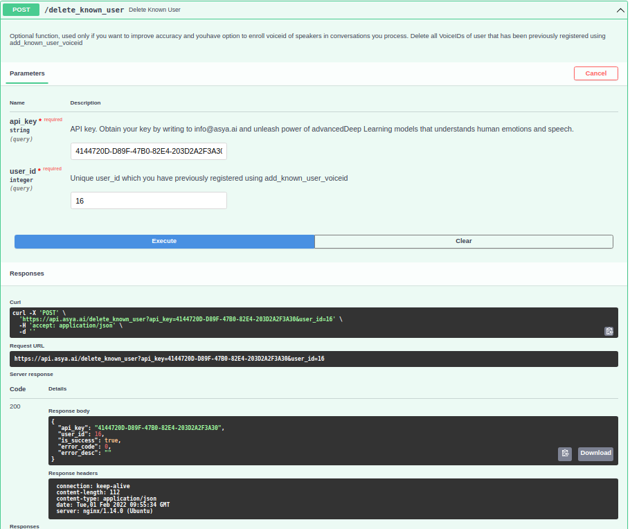

Ariel (user_id=16) is deleted:

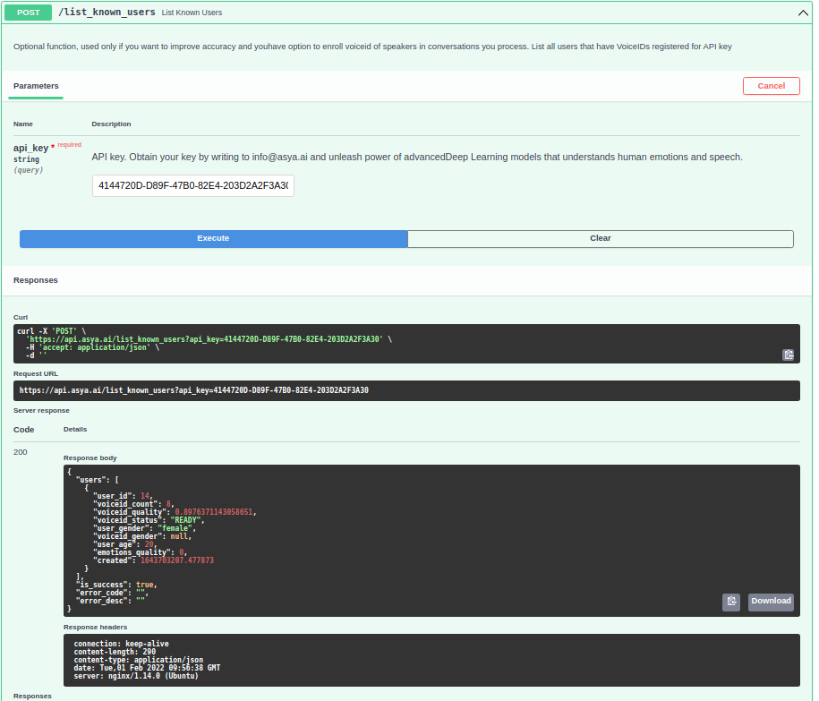

And all of the voiceid recordings are deleted aswell:

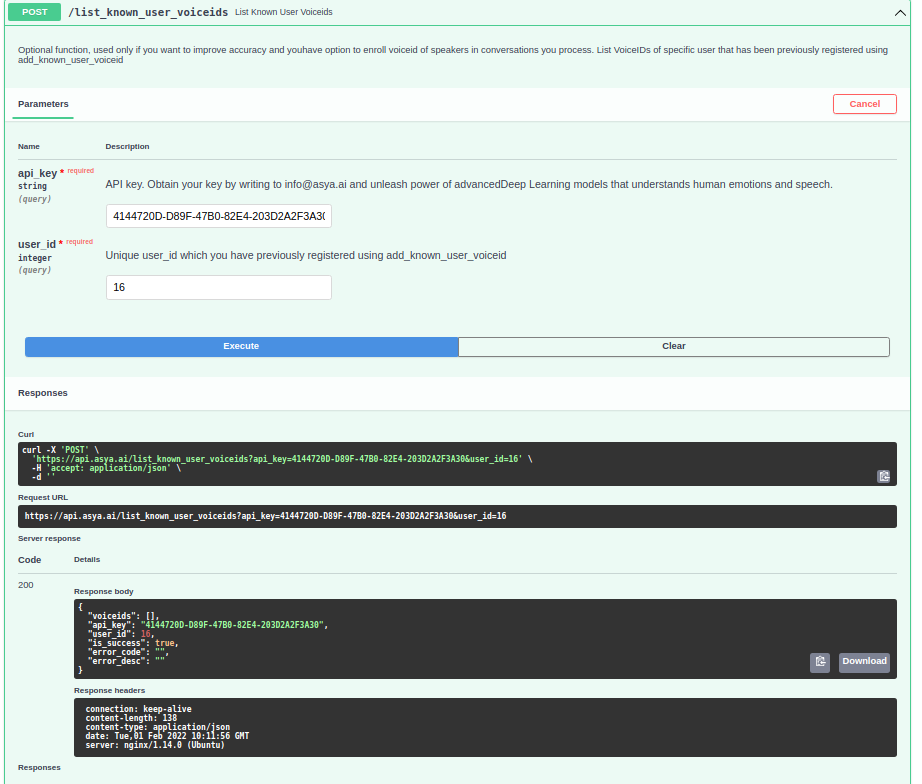

Adding back voiceid for Ariel with /add_known_user_voiceid and listing again with /list_known_user_voiceids:


Full JSON response:

```json
{
  "voiceids": [
    {
      "users_voiceid_uuid": "9150e38d-d7b4-4a3e-9bb1-8a7d8e5ab765",
      "file_name_original": "emotion_happy_6806b09b-eee1-4b17-a697-1b5c682bb3dc.wav",
      "length_sec": 24,
      "voiceid_status": "READY",
      "voiceid_quality": 0.639130434782609,
      "emotions_quality": 0,
      "created": 1643710477.884588
    },
    {
      "users_voiceid_uuid": "8e4f77b5-fd96-430b-875a-a9b47ad95027",
      "file_name_original": "emotion_calm_849824de-bb2b-4c35-aad6-531f369d43d8.wav",
      "length_sec": 28,
      "voiceid_status": "READY",
      "voiceid_quality": 0.771604938271605,
      "emotions_quality": 0,
      "created": 1643710485.041069
    },
    {
      "users_voiceid_uuid": "0c76d651-3389-488a-af51-f495004137d1",
      "file_name_original": "emotion_angry_4588b318-0bf6-40bc-8382-f9cd75e36c51.wav",
      "length_sec": 30,
      "voiceid_status": "READY",
      "voiceid_quality": 0.934444444444444,
      "emotions_quality": 0,
      "created": 1643710493.407363
    },
    {
      "users_voiceid_uuid": "e725540f-f393-43c6-9a2d-15d6f51e788c",
      "file_name_original": "emotion_sad_9b98cc13-42af-466e-84f4-4c21460ccba9.wav",
      "length_sec": 32,
      "voiceid_status": "READY",
      "voiceid_quality": 0.876041666666667,
      "emotions_quality": 0,
      "created": 1643710501.539333
    },
    {
      "users_voiceid_uuid": "9310197e-5f81-43f3-8123-e6bd40f65f60",
      "file_name_original": "laughter_5f497f66-753c-4e2e-a0d2-cf85dc4066c1.wav",
      "length_sec": 12,
      "voiceid_status": "READY",
      "voiceid_quality": 0.225,
      "emotions_quality": 0,
      "created": 1643710510.748588
    },
    {
      "users_voiceid_uuid": "5d3e4211-6d44-4fec-856a-758c5a0a1960",
      "file_name_original": "voice_questions_53c9a6fc-a7b1-4871-a5b0-a189cbd7315f.wav",
      "length_sec": 63,
      "voiceid_status": "READY",
      "voiceid_quality": 0.904761904761905,
      "emotions_quality": 0,
      "created": 1643710519.074775
    },
    {
      "users_voiceid_uuid": "72b03735-c51a-4cea-8f1f-c87d91feec67",
      "file_name_original": "voice_images_3d4e313c-af2f-4180-b9cf-c7bf08f8adf0.wav",
      "length_sec": 63,
      "voiceid_status": "READY",
      "voiceid_quality": 0.920634920634921,
      "emotions_quality": 0,
      "created": 1643710526.300358
    },
    {
      "users_voiceid_uuid": "112058b7-a76e-41d3-a1ca-2a08cf95ecc2",
      "file_name_original": "voice_reading_f18015a9-6a06-43d1-9be2-5360e40998c0.wav",
      "length_sec": 65,
      "voiceid_status": "READY",
      "voiceid_quality": 0.96875,
      "emotions_quality": 0,
      "created": 1643710534.169984
    }
  ],
  "api_key": "4144720D-D89F-47B0-82E4-203D2A2F3A30",
  "user_id": 16,
  "is_success": true,
  "error_code": "",
  "error_desc": ""
}
```

Also /list_known_users shows that user_id is added:

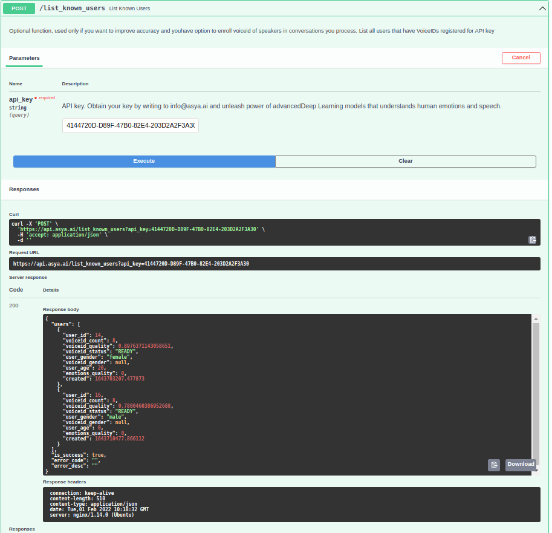

____

## Submiting recordings

### Testing single features only:

Submiting example recording "96_cut_anita_ariel.wav", features=audio_emotions:


Response status:

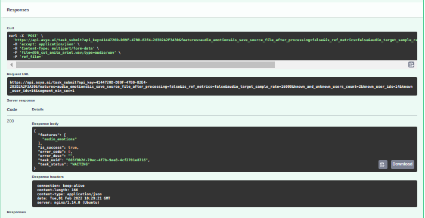

/task_status:

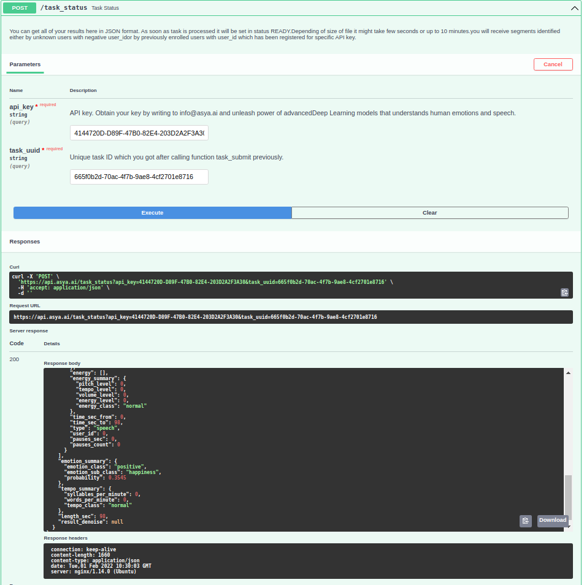

Task status response body:

```json
{
  "features": "",
  "request_status": "READY",
  "url_result_file": "",
  "is_success": true,
  "error_code": 0,
  "error_desc": "",
  "results": {
    "segments": [
      {
        "emotions": [
          {
            "time_sec_from": 0,
            "time_sec_to": 13,
            "emotion_class": "positive",
            "emotion_sub_class": "happiness",
            "probability": 0.29
          },
          {
            "time_sec_from": 15,
            "time_sec_to": 18,
            "emotion_class": "positive",
            "emotion_sub_class": "happiness",
            "probability": 0.19
          },
          {
            "time_sec_from": 19,
            "time_sec_to": 30,
            "emotion_class": "positive",
            "emotion_sub_class": "happiness",
            "probability": 0.35
          },
          {
            "time_sec_from": 32,
            "time_sec_to": 52,
            "emotion_class": "positive",
            "emotion_sub_class": "happiness",
            "probability": 0.20500000000000002
          },
          {
            "time_sec_from": 55,
            "time_sec_to": 88,
            "emotion_class": "positive",
            "emotion_sub_class": "happiness",
            "probability": 0.52
          },
          {
            "time_sec_from": 88,
            "time_sec_to": 97,
            "emotion_class": "negative",
            "emotion_sub_class": "sadness",
            "probability": 0.15000000000000002
          }
        ],
        "emotion_summary": {
          "emotion_class": "positive",
          "emotion_sub_class": "happiness",
          "probability": 0.311
        },
        "tempo": [],
        "tempo_summary": {
          "syllables_per_minute": 0,
          "words_per_minute": 0,
          "tempo_class": "normal"
        },
        "energy": [],
        "energy_summary": {
          "pitch_level": 0,
          "tempo_level": 0,
          "volume_level": 0,
          "energy_level": 0,
          "energy_class": "normal"
        },
        "time_sec_from": 0,
        "time_sec_to": 98,
        "type": "speech",
        "user_id": 0,
        "pauses_sec": 0,
        "pauses_count": 0
      }
    ],
    "emotion_summary": {
      "emotion_class": "positive",
      "emotion_sub_class": "happiness",
      "probability": 0.3545
    },
    "tempo_summary": {
      "syllables_per_minute": 0,
      "words_per_minute": 0,
      "tempo_class": "normal"
    },
    "length_sec": 98,
    "result_denoise": null
  }
}
```

Testing with javascript_data_viewer, shows the emotions stats:

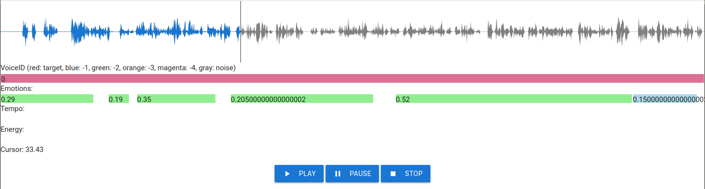

___

### Testing all features with recording  96_cut_anita_ariel.wav:

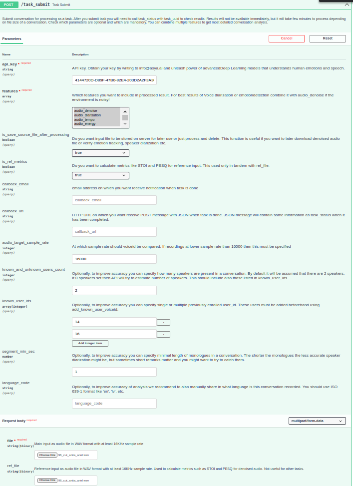

Response status:

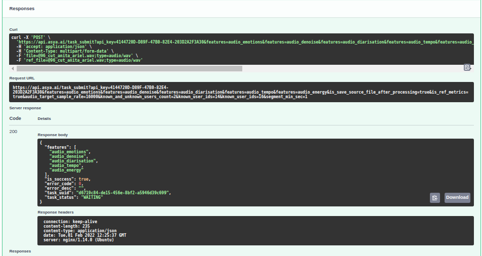

Running /task_status to get JSON and download denoised wav file using link under "url_denoised".

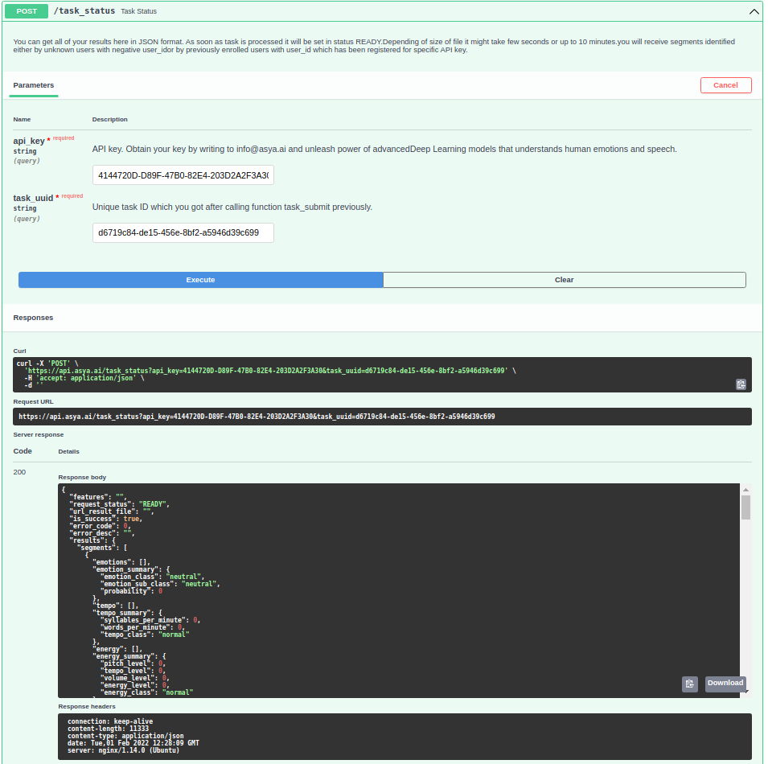

Using javascript_data_viewer to display info from json "results" and denoised .wav file (this screenshot shows stats on 96_cut_anita_ariel.wav that was downloaded after processing):

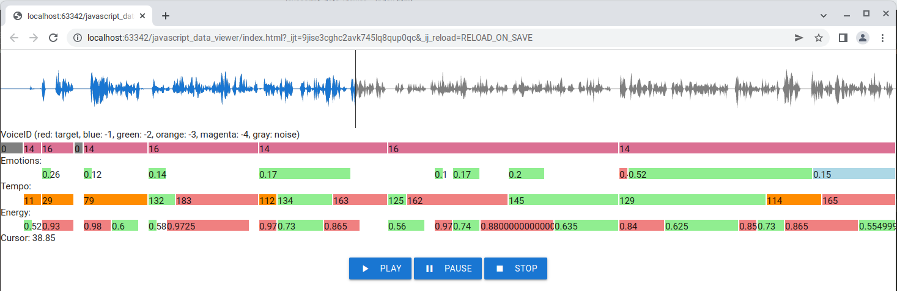
